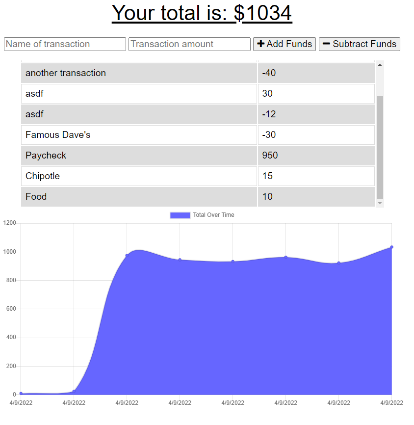

# Budget Buddy

## Website

https://afternoon-badlands-41292.herokuapp.com/

## Description

Budget Buddy is an app where a user can keep track of their expenses regardless of their internet connection! Just enter any transaction, and the provided information will be stored locally or in a MongoDB database based on the user's internet connection. The graph will adjust based on this input.



## Instructions for Local Use

1. clone the main branch from [GitHub](https://github.com/mimi5930/Budget-Buddy)

2. Navigate to the root directory

```
~/budget-buddy
```

3. Install the npm dependencies

```
npm install
```

4. Run the app from the root directory

```
npm start
```
